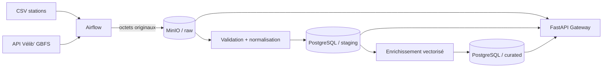

# VelibPulse Data Lake

Projet final **Data Lakes & Data Integration** — EFREI 2025-2026  
Auteur : **Jacq VENGADESAN** — classe **BDML2**

VelibPulse collecte la localisation des stations Vélib' depuis un jeu de données CSV et
leur disponibilité depuis l'API GBFS publique. Le pipeline conserve les sources telles
qu'elles ont été reçues, les normalise, puis calcule des indicateurs directement
exploitables : taux de vélos, part de vélos électriques, pression de la station et niveau
d'alerte.

## Ce qui est livré

- architecture `raw / staging / curated` ;
- deux sources : fichier CSV et API JSON sans clé ;
- zone raw dans MinIO, compatible S3 ;
- zones staging et curated dans deux schémas PostgreSQL distincts ;
- pipeline Airflow idempotent, planifié toutes les cinq minutes et utilisant XCom ;
- API FastAPI avec tous les endpoints imposés ;
- niveau avancé : `/ingest` et `/ingest_fast`, plus un benchmark reproductible ;
- conteneurisation Docker Compose, tests automatisés et documentation technique.

## Architecture en un coup d'œil



Les décisions détaillées et le dictionnaire des données sont dans
[`docs/ARCHITECTURE.md`](docs/ARCHITECTURE.md). Le rapport de rendu est dans
[`docs/RAPPORT_TECHNIQUE.md`](docs/RAPPORT_TECHNIQUE.md) et les mesures réelles dans
[`docs/BENCHMARK_RESULTS.md`](docs/BENCHMARK_RESULTS.md).

## Démarrage rapide avec Docker

### Prérequis

- Docker Desktop avec Docker Compose v2 ;
- environ 4 Go de mémoire disponible (6 Go avec Airflow) ;
- ports `8000`, `9000`, `9001`, `5432` et éventuellement `8080` libres.

Le flux Vélib' est public et ne nécessite aucune clé API.

```powershell
Copy-Item .env.example .env
docker compose up --build -d
```

Le service `init` crée le bucket, les schémas SQL, ingère le CSV et récupère un premier
instantané de l'API. Une fois les services démarrés :

- Swagger FastAPI : <http://localhost:8000/docs>
- MinIO : <http://localhost:9001> (`velib` / `velib-secret` par défaut)
- santé des services : <http://localhost:8000/health>

Vérification rapide :

```powershell
Invoke-RestMethod http://localhost:8000/health
Invoke-RestMethod "http://localhost:8000/raw?limit=10"
Invoke-RestMethod "http://localhost:8000/staging?limit=5"
Invoke-RestMethod "http://localhost:8000/curated?alert_level=critical&limit=5"
Invoke-RestMethod http://localhost:8000/stats
```

Pour arrêter sans effacer les données :

```powershell
docker compose down
```

Pour repartir de zéro, la suppression explicite des volumes est :

```powershell
docker compose down -v
```

Cette dernière commande efface le contenu du lake local.

## Activer Airflow

Airflow est placé dans un profil pour ne pas imposer son coût mémoire lors d'une simple
démonstration de l'API :

```powershell
docker compose --profile orchestration up --build -d
```

L'interface est disponible sur <http://localhost:8080> avec `airflow` / `airflow`.
Le DAG `velibpulse_data_lake` est déclenché toutes les cinq minutes. Il exécute :

1. initialisation idempotente des stockages ;
2. archivage et upsert du référentiel fichier ;
3. collecte du JSON GBFS dans raw ;
4. normalisation en staging et enrichissement en curated.

La clé de l'objet raw est transmise entre tâches via XCom. `max_active_runs=1` évite
que deux collectes concurrentes se chevauchent.

## API Gateway

| Méthode | Endpoint | Rôle |
|---|---|---|
| `GET` | `/health` | État de l'API, MinIO et PostgreSQL |
| `GET` | `/stats` | Volumes et nombres de lignes, même en cas de panne partielle |
| `GET` | `/raw` | Liste paginée des objets bruts |
| `GET` | `/raw/{key}` | Lecture d'un objet brut précis |
| `GET` | `/staging` | Instantanés normalisés, filtrables par station |
| `GET` | `/curated` | KPI filtrables par station et niveau d'alerte |
| `POST` | `/ingest` | Ingestion avancée ligne par ligne (baseline) |
| `POST` | `/ingest_fast` | Calcul vectorisé et insertions SQL groupées |

Les paramètres `limit` et `offset` empêchent le chargement accidentel de toute la base.
FastAPI rejette automatiquement les compteurs négatifs, les lots vides, les champs
inconnus et les lots de plus de 10 000 éléments.

Exemple d'ingestion :

```powershell
$body = @{
  data = @(
    @{
      station_code = "DEMO-001"
      observed_at = (Get-Date).ToUniversalTime().ToString("o")
      mechanical_bikes = 8
      electric_bikes = 4
      docks_available = 12
      is_installed = $true
      is_renting = $true
      is_returning = $true
    }
  )
} | ConvertTo-Json -Depth 4

Invoke-RestMethod -Method Post -Uri http://localhost:8000/ingest_fast `
  -ContentType application/json -Body $body
```

## Benchmark du niveau avancé

Les deux routes produisent le même résultat métier. La différence est volontairement
technique :

- `/ingest` calcule et écrit chaque ligne séparément ;
- `/ingest_fast` vectorise les calculs NumPy puis effectue deux insertions batch.

Mesurer un lot de 1 et un lot de 100, cinq fois chacun :

```powershell
python -m pip install -e ".[dev]"
python scripts/benchmark.py --url http://localhost:8000 --repeats 5
```

Le rapport JSON est écrit dans `benchmark-results/latest.json`. Une mesure de référence
réalisée sous Docker est documentée dans `docs/BENCHMARK_RESULTS.md` : le gain médian
mesuré sur 100 éléments est de **69,51 %**. Les médianes sont
utilisées pour réduire l'effet des aléas réseau et disque. Un échauffement préalable
retire des mesures le coût d'ouverture des pools. Les chiffres doivent être produits sur
la machine de soutenance pour confirmer ce résultat. Sur un seul élément,
la version batch peut être équivalente ou légèrement plus lente ; le gain attendu se
manifeste sur le lot de 100.

## Exécution sans Docker et tests

L'API complète nécessite MinIO et PostgreSQL. En revanche, les fonctions de
transformation et les tests unitaires n'en dépendent pas :

```powershell
python -m venv .venv
.\.venv\Scripts\Activate.ps1
python -m pip install -e ".[dev]"
pytest --cov=src --cov-report=term-missing
ruff check .
```

Exécuter manuellement le pipeline lorsque les stockages sont disponibles :

```powershell
python -m src.cli init
python -m src.cli reference
python -m src.cli api
# ou les trois opérations :
python -m src.cli run
```

## Sources des données

- fichier : export CSV « Vélib' — localisation et caractéristique des stations »,
  Ville de Paris / Autolib' Vélib' Métropole, licence ODbL ;
- API : `station_status.json` de Vélib' Métropole, GBFS 1.0, sans clé et actualisée
  environ chaque minute.

Le dépôt contient un extrait CSV de dix stations pour rendre la démonstration immédiate.
Pour travailler sur l'export complet, remplacez `data/source/stations_reference.csv` par
le CSV officiel en conservant les colonnes techniques. La transformation accepte aussi
les libellés français de l'export.

## Organisation

```text
.
├── dags/                    # orchestration Airflow
├── data/source/             # dataset fichier versionné (extrait reproductible)
├── docs/                    # architecture et rapport personnalisé
├── scripts/benchmark.py     # mesures du niveau avancé
├── src/
│   ├── api.py               # routes FastAPI
│   ├── services.py          # cas d'usage du pipeline
│   ├── transformations.py   # normalisation et KPI purs
│   └── storage/             # adaptateurs MinIO et PostgreSQL
├── tests/                   # tests unitaires et API
└── docker-compose.yml
```

## Limites assumées

- L'extrait CSV ne couvre que dix stations ; les stations absentes restent néanmoins
  traitées avec la capacité observée et un nom de repli.
- `pressure_score` est un indicateur explicable, pas une prédiction ML : `0` signifie
  une station équilibrée, `1` une station vide ou pleine.
- Le benchmark dépend du matériel et de l'état de Docker ; il doit être relancé avant la
  soutenance.
- La rétention des objets raw n'est pas automatisée dans ce prototype pédagogique.
