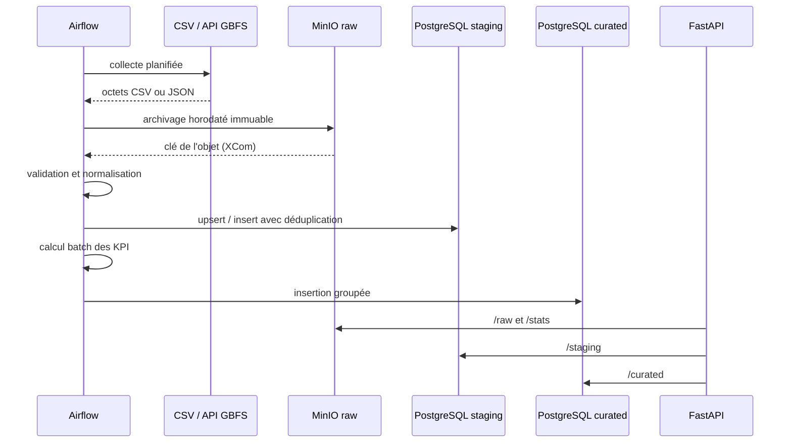

# Architecture technique

Auteur : **Jacq VENGADESAN — BDML2**

## 1. Décision d'architecture

VelibPulse applique l'architecture médaillon enseignée en cours. Chaque couche change
le niveau de confiance des données, et non seulement leur emplacement.

| Zone | Contrat | Technologie | Justification |
|---|---|---|---|
| raw | données reçues sans modification | MinIO / API S3 | objet, économique, formats hétérogènes, rejouable |
| staging | schéma uniforme et types contrôlés | PostgreSQL `staging` | contraintes, filtres temporels, déduplication |
| curated | indicateurs métier enrichis | PostgreSQL `curated` | lecture directe par API ou outil BI |
| serving | accès contrôlé et documenté | FastAPI | validation Pydantic, OpenAPI, performance ASGI |

MinIO répond à la contrainte S3 de la zone raw tout en gardant le projet gratuit et
local. PostgreSQL est préférable ici à une seconde collection de fichiers : les usages
finaux filtrent par station, date et niveau d'alerte. Les index SQL répondent directement
à ces accès.

## 2. Flux et responsabilités

Les transformations ne dépendent ni de boto3 ni de SQLAlchemy. Cette séparation rend
la logique testable, permet de changer le stockage et évite de mélanger règles métier et
I/O.

## 3. Modèle de données

### `staging.station_reference`

| Colonne | Type | Description |
|---|---|---|
| `station_code` | texte, PK | identifiant public stable |
| `name` | texte | nom de la station |
| `capacity` | entier | capacité annoncée |
| `latitude`, `longitude` | réel | coordonnées WGS84 |
| `source_ingested_at` | timestamp UTC | date d'ingestion du CSV |

### `staging.station_snapshot`

Une ligne représente l'état d'une station à un instant. L'unicité
`(station_code, observed_at, source)` rend la réexécution idempotente.

Les compteurs mécaniques et électriques sont conservés séparément. Le total est aussi
matérialisé pour simplifier les lectures. Les trois drapeaux GBFS (`installed`, `renting`,
`returning`) permettent de distinguer une station vide d'une station hors service.

### `curated.station_kpi`

| KPI | Formule / règle |
|---|---|
| `availability_rate` | vélos / (vélos + bornes libres) |
| `dock_rate` | bornes libres / total observé |
| `ebike_share` | vélos électriques / vélos disponibles |
| `pressure_score` | `2 × abs(availability_rate - 0.5)` |
| `service_state` | balanced, bikes_shortage, docks_shortage ou offline |
| `alert_level` | critical à 0 vélo/borne ou hors ligne ; warning sous 15 % ou au-dessus de 85 % |

La capacité de référence est privilégiée. Si le référentiel ne contient pas une station,
le pipeline utilise `vélos + bornes` : le flux API complet reste donc exploitable même
avec l'extrait CSV livré.

## 4. Robustesse

- Les réponses HTTP non 2xx déclenchent une erreur explicite et Airflow réessaie deux
  fois.
- Le JSON est validé avant archivage ; sa structure est contrôlée avant transformation.
- Le CSV accepte un BOM, les noms de colonnes techniques ou français, et rejette des
  coordonnées invalides avec le numéro de ligne.
- Les compteurs négatifs sont refusés par l'API et neutralisés lors de l'ingestion d'une
  source externe non maîtrisée.
- Les contraintes uniques rendent le pipeline rejouable.
- `/health` et `/stats` isolent chaque dépendance : une panne MinIO n'empêche pas de
  connaître l'état de PostgreSQL.
- Tous les timestamps sont convertis en UTC.
- Les endpoints de lecture sont bornés à 1 000 lignes par requête.

## 5. Optimisation avancée

La baseline suit une implémentation naturelle : boucle Python, calcul ligne par ligne,
puis une requête SQL par élément. La route rapide apporte :

1. calcul vectorisé avec tableaux NumPy ;
2. classification de tous les états par masques booléens ;
3. une insertion groupée en staging et une en curated ;
4. réutilisation des pools de connexion et du client S3.

La complexité reste linéaire, mais le nombre d'allers-retours SQL passe de `2n` à `2`.
C'est le principal gain sur un lot de 100. Le script de benchmark mesure le temps vu par
le client, ce qui inclut validation, raw, calcul et stockage et évite une comparaison
artificielle d'une seule fonction.

## 6. Sécurité et passage en production

Le projet local utilise des identifiants de démonstration. Pour une production :

- injecter les secrets par un gestionnaire dédié et changer tous les mots de passe ;
- placer l'API derrière TLS et une authentification OAuth2 ;
- donner à chaque service un compte à privilèges minimaux ;
- appliquer une politique de cycle de vie au bucket raw ;
- remplacer Airflow SQLite/SequentialExecutor par PostgreSQL/CeleryExecutor ;
- ajouter métriques Prometheus, traces et alertes ;
- partitionner `station_snapshot` par mois lorsque l'historique grandit.

